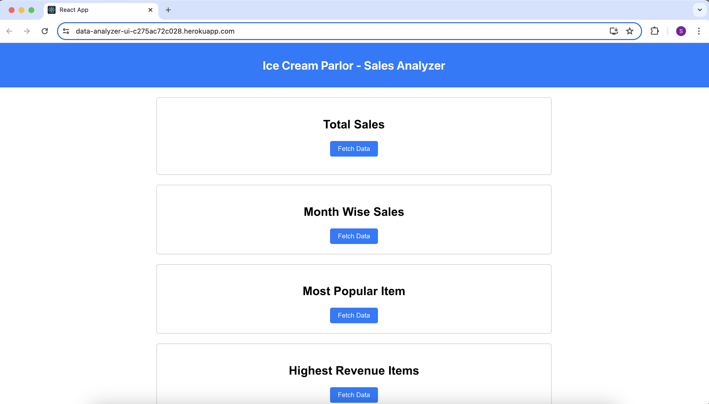

# Ice Cream Parlour Sales Analyzer

Ice Cream Parlour Sales Analyzer is a React web application designed to analyze sales data from an ice cream parlour and provide insightful reports on sales performance. This application offers various features to understand the store's sales trends and identify popular items.

## Features

- **Total Sales**: View the total sales of the ice cream parlour.
- **Month-wise Sales Totals**: Explore sales totals for each month.
- **Most Popular Item**: Identify the most popular item (highest quantity sold) for each month.
- **Items Generating Most Revenue**: Find out which items are generating the most revenue monthly.
- **Detailed Statistics for Most Popular Item**: Gain insights into the most popular item each month with statistics like minimum, maximum, and average orders.

## Technologies Used

- Node.js
- React
- JavaScript (ES6+)
- HTML5
- CSS3

## Data Source

The application requires a structured dataset containing sales data from the ice cream parlour. Ensure the dataset includes information such as item names, quantities sold, prices, and timestamps.

## Deployment

This project is deployed and accessible at [Data Analyzer](https://data-analyzer-ui-c275ac72c028.herokuapp.com/).

## Getting Started

To run this project locally, follow these steps:

1. Clone this repository.
2. Install dependencies using `npm install`.
3. Run the development server using `npm start`.
4. Open [http://localhost:3000](http://localhost:3000) in your browser.

Note : Backend project should be up and running for this to work.

## Screenshots

